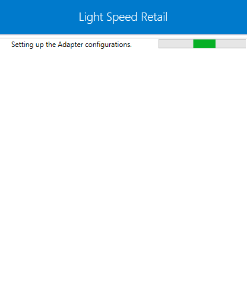
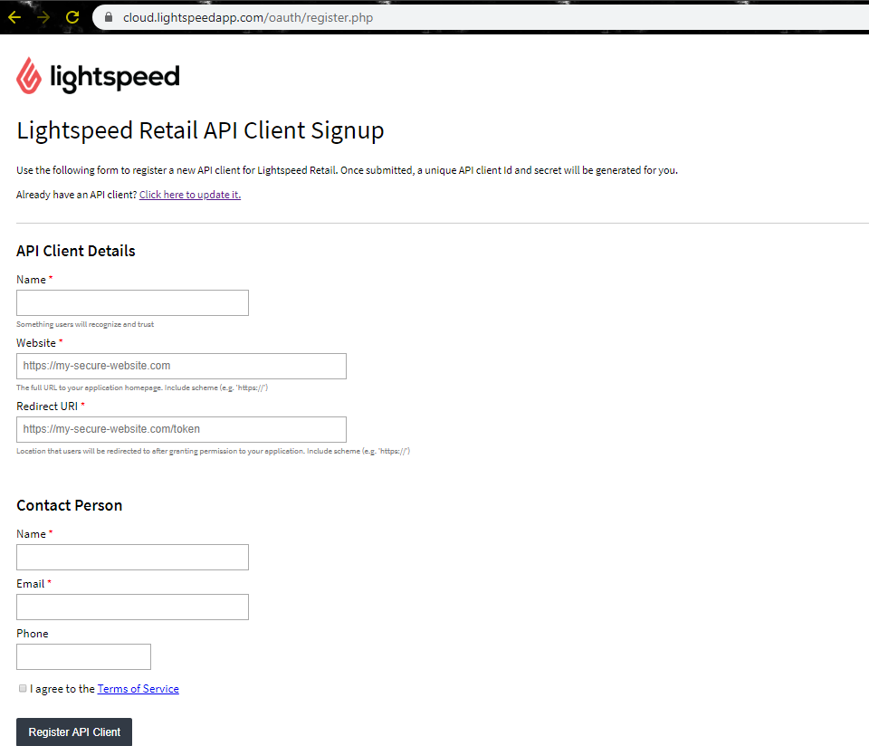
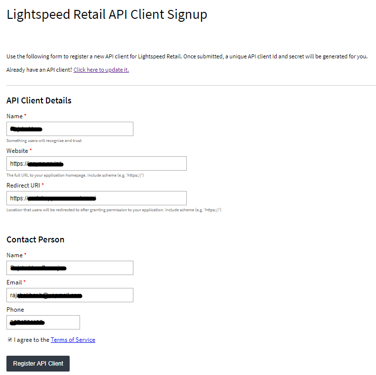
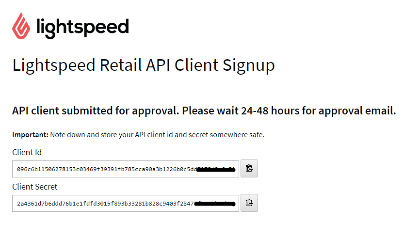
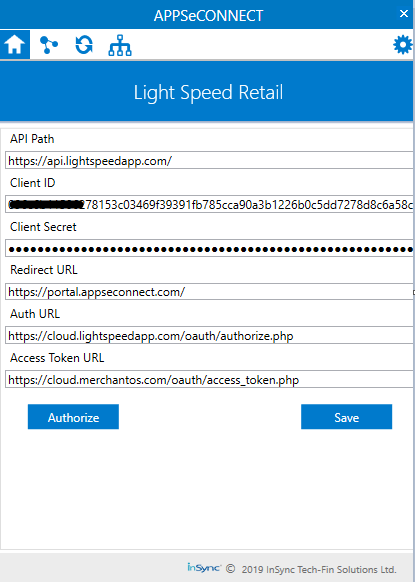
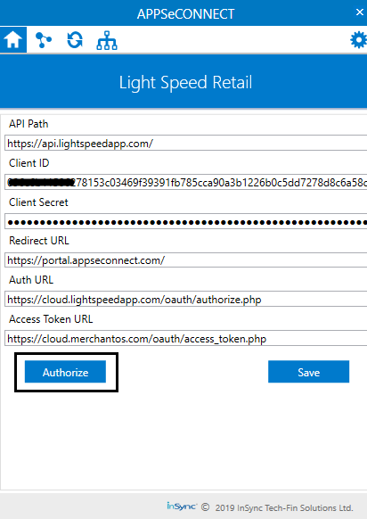
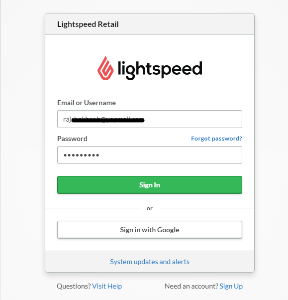
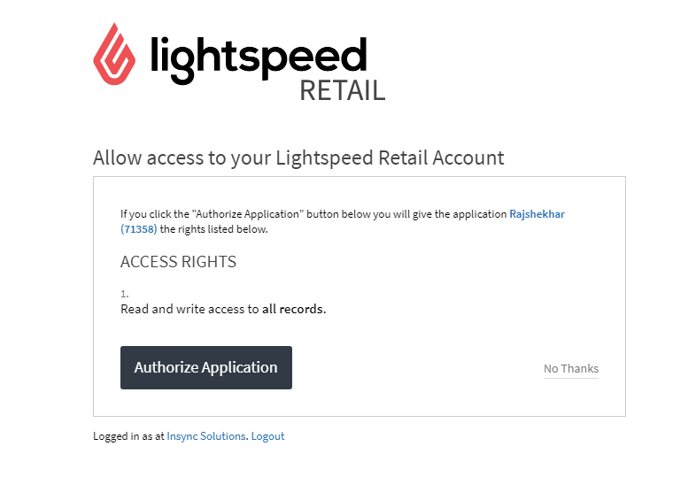
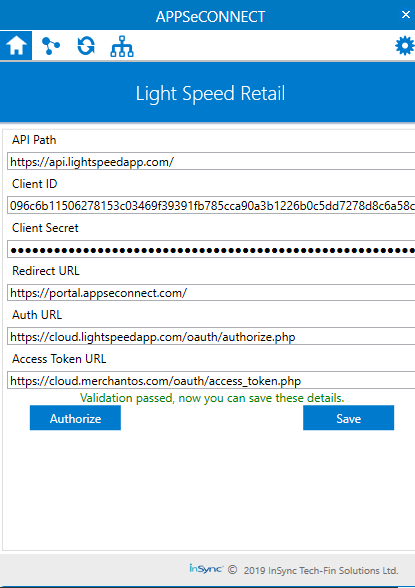

Lightspeed offers a cloud-based e-commerce solution that allows users to manage in-store and online inventory, 
view all customer information, have a single view of customers and analyze multi-channel sales data 
from one system. Lightspeed also provides functionality for customizable checkout, upsell and cross-sell features, related product recommendations, 
promotions and custom pricing for single items or groups of items and customer product reviews. 

Application configuration is an integral activity prior to the process of integration. You need to configure the agent by providing the `API Path`, `Client ID`, `Client Secret`, `Redirect URL`, `Auth URL` and `Access Token URL`. 
Here you will find the detailed description on how to configure the agents 
for the application of Lightspeed, Troubleshooting issues and the attributes and action. This section provides you the detailed process of validating the credential of the 
application Lightspeed.

# Pre-requisites for Lightspeed Configuration  

1.	You need to have valid credentials of the portal.
2.	You need to [choose the Lightspeed](/getting%20started/configurations/#process-of-choosing-app) Application from the APP section. 
3.	[Create a connection](/getting%20started/configurations-for-integration/#configuring-connector-while-creating-connection)with Lightspeed. 
4.	Publish the workflow and the connection in the portal. Update Configuration & Update Adapter to deploy the configurations made in Portal to the On-Premise Agent.
**Exit and Restart the On-Premise Agent after Updating Adapters.**

If you are using Process Flow, you just need to [deploy](/deployment/Environment-Management/) the designed Process Flow, for getting the configuration page of the chosen application.

## Steps to Configure Lightspeed Credential in OP Agent

1.	In the App Configurational Panel of the agent, Click on the + button beside the app Lightspeed.  
2.	The Adapter configurations will get downloaded automatically (within a timespan). You can now proceed with credential authorization.  

3.	You can view the fields for validating the Lightspeed adapter, after the configurations setup is over. 
The following are the fields available for validating the adapter.  
* API Path - This is the Base URL of the Lightspeed application you are using.
* Client ID - This is the ID obtained authorization from the user which is generated in the application.
* Client Secret - A secret key that establishes the ownership of the Consumer Key generated by you.
* Redirect URL - This is the secondary URL or the Call Back URL required for data restoration.
* Auth URL - This URL obtains the user authorization for Consumer access.
* Access Token URL - The URL used to exchange the User-authorized Request Token for an Access Token

4.	To register for an OAuth client, use the [OAuth Client Registration](https://cloud.lightspeedapp.com/oauth/register.php) Page. 
You can view the below screen with the fields for API Client Details & Contact Person. 

5.	The following are the details you need to provide for completing the Registration Process.
For API Client Details:
* Name (mandatory): This field requires the integration name which users will see when approving access for your OAuth client. This name should describe your application well so that users understand which application is asking for permission to their account. 
* Website (mandatory): The Website URL point to any valid website. 
* Redirect URL (mandatory): This URL will receive the temporary code that you can use to request an access token. The users will be redirected to this location after granting permission to any valid website. 
**For Contact Person Details**
* Name (mandatory): This field requires the main contact person name 
* Email (mandatory): This field requires a valid email address. We will use this email address to send you API-related announcements. Make sure you can receive email at this address and keep it up to date as needed. 
* Phone (Optional): A valid phone number.  

6.	Once the details are provided, click on the Register API Client Button. The Client ID & Client Secret would be generated. 
**It is recommended to store and save the generated Client ID and Secret as you will not be able to look them 
up after as it takes 24-48 hours for the generated credentials to validate and get 
registered.**

7.	Navigate back to the Agent Credential page and enter the generated details. 
**You will get the details of the API Path, Auth URL & Access Token URL in the 
[API Documentation of Lightspeed](https://developers.lightspeedhq.com/retail/introduction/introduction/)**. 

8.	After giving details of all the fields, click the Authorize button. The following window appears. 

9.	Enter the lightspeed application credentials to authorize the validation process. 

10.	Click on the Authorize Application button after providing the credentials. 

11.	You will be redirected to the Call back URL. Upon successful redirection, you can view the successful validation message in the Agent.
 
12.	Click SAVE Button.  

## Attributes and Actions 
While defining a connection to an API endpoint in Lightspeed, you require clear understanding about the data requirements and endpoint configurations. You can refer to this document to find all the endpoint details of your Lightspeed Application.
To define the endpoint in APPSeCONNECT, you need Actions and Entities. Actions are specifically targeted for an endpoint while schema is the data needed to execute the API. Here, is the list of some of the pre-packaged API actions defined for you which you can easily plug and play while doing your integrations.

|Endpoint|Action|Action Type|Schema|API Help|
|---|---|---|---|------|
|Customer|Customer|GET|Customer|[Fetch Customer from Lightspeed](https://developers.lightspeedhq.com/retail/endpoints/Customer/#get-all-customers)|
|Customer|Post/Customers|POST|Customer|[Adding Customers to Lightspeed](https://developers.lightspeedhq.com/retail/endpoints/Customer/#post-create-a-customer)|
|Item|Item|GET|Item|[Fetching Items from Lightspeed](https://developers.lightspeedhq.com/retail/endpoints/Item/#get-all-items) |
|Item|Post/Item|POST|Item|[Adding Items to Lightspeed](https://developers.lightspeedhq.com/retail/endpoints/Item/#post-create-an-item)|
|Image|Image|GET|Image|[Fetching Images of Items from Lightspeed](https://developers.lightspeedhq.com/retail/endpoints/Image/)|
|Sale|Sale|GET|Sale|[Fetching Sales or fulfillments from Lightspeed](https://developers.lightspeedhq.com/retail/endpoints/Sale/#get-all-sales)|
|Sale|POST/Sales|Post|Sale|[Adding Orders/Sales to Lightspeed](https://developers.lightspeedhq.com/retail/endpoints/Sale/#post-create-a-sale)|

				 

