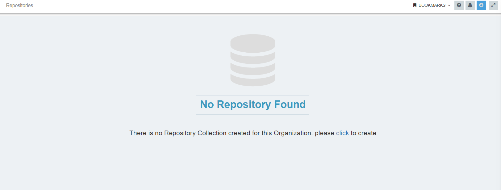

The APPSeCONNECT portal is the web based interface where you can access APPSeCONNECT application for integration, with the set of Functional modules. The [APPSeCONNECT portal page](https://portal.appseconnect.com/Account/Login?ReturnUrl=%2f#!) is easily accessible. 
Once you have logged in, some elements of the APPSeCONNECT portal are common to all apps, accessible via the left side panel of the page. Of note, these also includes accessing your account, where you can update your information as well as change your password.

The set of functional modules are easy to navigate and ease the method of integration via our Portal. 
The view of functional module(s) is given below :

Let us walkthrough the Functional Modules for understanding the usage and need of each menu. 

|Modules|Details|
|---|---
|[Home](/accessing%20portal/accessing-portal/#home)|This page will show the details of the organisation,User Logged in into,Project Basic Information,Configuration Completion Details,Subcription details etc.|
|[Designer](/accessing%20portal/accessing-portal/#designer)|This section will allow the user to design the business flows using Workflows or Processflows.|
|[Deploy](/accessing%20portal/accessing-portal/#deploy)|This section will let the users work with different Environments that are currently available for performing their respective integrations.|
|[Manage](/accessing%20portal/accessing-portal/#manage)|This section will allow the users to manage their Apps,Connections,Rules,Repositories,APIs,Feeds etc.|
|[Help](/accessing%20portal/accessing-portal/#help)|This section will allow the user to get help and learn about the usability of the features.User can easily connect to the Documentation and Community resource from HELP.|

## Home

**For Older users, the old DASHBOARD page is the new HOME page of the APPSeCONNECT portal**

The **Home page** is the default page which you can view after logging in to the APPSeCONNECT portal. In this page you can see the snapshot of the project at a glance with respect to the activities of the user.   

The Home page view captures the following information - 
1.	Project Basic Information
2.	Configuration Completion Details
3.	Subscription Details
4.	Execution Status
5.	Execution Counts 
6.	Sync Errors
7.	Execution Logs
8.  Process Errors

Click on the widgets to expand and view the related functionality of the widgets in details.

*1. Project Basic Information : This widget displays the basic information of the organisation.*  
The details displayed in the widget are :   
 
a.  Project Name : Shows the organisation name.    
b.  Main Contact Person : Displays the contact detail (Email Id only) of the project holder.    
c.  Implementation contact : Displays the Email id of InSync implementation Team.    
d.  Sales Contact : Shows the Email id of InSync Sales Team.    
e.  Support Contact : Displays the Email Id of the InSync Support Team.   

*2. Configuration Completion Details : This widget displays the configural informations related to the organisation project such as number of apps used,how many connections created,agent installed etc. 
This widget also has a progress bar that displays the progress status for the organisation.* 

*3. Subscription Details : This widget will inform the user about the categories of applications subscribed for the organisation.* 

These are the following information that will be displayed in the widget.  
a.	Subscription Plan  
b.	Remaining Days  
c.	Subscription Expiry date  
d.	Application Categories Subscribed.  

**Note: User can minimize or expand the above three widget as per their requirement.** 
 

*4. Execution Status : This widget displays the data synced with respect to an organization and is categorized based on the status : Success, Skipped & Failure.* 
The percentage is displayed on a pie chart irrespective of connections. Hovering over the section on the pie chart will display the exact 
number of data based on the statuses. Users can minimize and maximize the widget by click on the respective button available on the top right 
corner of the widget. 

**Note: The close button remains in disabled state.** 

*5. Execution Counts : This widget displays the data counters with respect to each connection in form of a Bar chart.* 
This widget displays the status of each connection based on :  Success, Unprocessed, Skipped & Failed. 
Users can minimize and maximize the widget by click on the respective button available on the top right corner of the widget.        
**Note : The close button remains in disabled state** 

*6.Sync Errors : This widget will display all the errors occurred, irrespective of the connections for the organisation.* 
For each error, the following details would be displayed.    
a.	The time of the error faced.     
b.	Error Faced.    
c.	The source id of the item.    

*Note: Only the latest 100 errors would display in the widget.* 

Users can search the error based on the source id and the error name by click on the search icon available on the top right corner of the widget. 
Users can minimize and maximize the widget by click on the respective button available on the top right corner of the widget. 
Note : The close button remains in disabled state.

*7. Execution Logs : This widget will display the execution logs of all the workflows & Realtime Time touchpoints executed through autosync.* 
Every log would display these following details :  

a.	Connection Name  
b.	Touchpoint/Workflow name  
c.	Start time of the Execution  
d.	Finishing Time  
e.	Time taken to execute  

Users can minimize and maximize the widget by click on the respective button available on the top right corner of the widget.  
     
**Note:(a) The close button remains in disabled state.  
       (b)Logs would be displayed only for autosync execution processes** 

*8. Process Errors : This widget will display all the errors relating to processing of data such as no data is available for posting to your destination application,posting of same data to your destination applications etc.*   

## Designer

This section will enable the user to design their business specific integration flows using their selected Apps. You can easily create and design your integration flows using 
Workflows and Processflows. Below are the list that provides you with the informations of **processflows**.

### Workflows

APPSeCONNECT Workflow enables you to orchestrate business scenarios visually through a graphical interface. It equips you to handle any business context with proper logic and perform multiple business transactions in a flow, without manual intervention. As data is an integral part of any business and efficient utilization of that data is one of the most important aspects of integration, workflow ensures that those data gets passed from one point of execution to another based on the procedural rules as set by you. 
Organizations use workflows to coordinate tasks and synchronize data between systems, with the ultimate goal of improving organizational efficiency, responsiveness and ease of use. 
Another situation is when you want to handle a large volume of data which is often challenging for the businesses in terms of performance. Henceforth, Workflows provide you with the tools to handle these scenarios with minimal effort. 

To know more about Workflow Management, [Click here](/workflow/overview/).

### ProcessFlow

`Processflow` is a visual representation of a business process integration, which enables you as a citizen integrator or developer to orchestrate a business process in such a way so that you can modularize and control the complexity of business integration properly. 
Processflows are the advanced workflows that enables you to design node specific flows which brings the ability to cater unique business process. 
Processflow is enabled with an advanced monitoring system that provides you with every detailed logs for troubleshooting purpose for each of your failed deployments and syncs. Also, processflow provides a **Packaging** system that enables the user to zip designed Processflows into packages 
that enables you to share and install them in other organisations.

To know more about Processflows, [Click Here](/processflow/overview-of-processflow/)

## Deploy

This section will allow you to work with different **ENVIRONMENTS** either On-Premise or Hosted. You can perform multiple deployment functionalities that will help you setting up your environments. 

### Environment

[Environment](https://docs.appseconnect.com/getting%20started/configurations-for-integration/#configuring-environment---agent-download--cloud-agent-configuration) page lists the devices that have access to the project that the customer is working on. 

## Manage

This section will allow you to manage the applications, connections, rules and other modules of APPSeCONNECT. Below are the modules 
that will be available to you under the **MANAGE** section in portal. 

### Users

 Users is one of the main feature of APPSeCONNECT portal as this controls the access the user has. Depending on the role of the user, the menu panel of the portal is customized such that the user can use the functionalities depending on the role allotted to him.

 * We can add multiple users to a particular project on the cloud portal by clicking on 'Users'. 
 * Each user will have different levels to the portal depending on the role allotted to them. 
 * Depending on the role, different users have different levels of permission to access the various features. 
 * These roles are Organization Admin, Implementer, Partner and many more. 
  
**Protip** - According to the present scope of understanding, there you will encounter 2 main roles as given below : 
{:.notice--info} 

(a) **Implementer :** In APPSeCONNECT, an implementer is a user who sets up the integration solution, depending on the customer's requirement. An implementer can modify a project once it has 
 been created by the Admin. He or she can edit the project and its status. An implementer has access to specific projects. 

(b) **Organization Admin : ** The access level of the customer is called the 'Organization Admin'. He or she can add/ choose apps. Create connections and setup workflows but he or she cannot setup roles, regulate the control of users, or bring about any configurational changes. 

A company can have multiple user for an organisation in APPSeCONNECT project. Every project in APPSeCONNECT 
has a single user `organisation owner` by default, implementers/users of APPSeCONNECT can add multiple 
users to an organisation for providing multiple access to its organisation users assigning different roles 
to each.

The roles that can be provided to each user are :  
a.	Connection Manager  
b.	Organization Admin  

#### Prerequisite for adding a User

* There should be an organisation present with APPSeCONNECT.
* User being added should not be a user for a different organisation. 

#### Steps to add USER to an organisation

1) Login to the APPSeCONNECT Portal and navigate to the USER module under Manage.  
2) By default, the interface would be of the tab Client Users. By default, APPSeCONNECT user would view the interface of the tab Client Users. 

**Note : The tab Partners will not have any view unless an organization has any requirements for partners.**

3)	For a fresh organisation, only the organisation owner will be displayed as the user in the user list. Click on the Add User button, to add more user to an organisation.

4) On clicking the button Add User, a sliding window opens with a form for providing the details of new user to the organisation.

5) Input the details and assign the role to the user that is being added. Specify the Role for the user that is being added. 

6) Once all the mandatory fields are filled up, click on the Save button. The created user should be visible in the list of users along with a success message. The created user will have the following keys available for any modification. The list is provided below :

- Edit User : Only the details of the created user can be modified except the Email Address.

- Revoke User Permission : The delete button is for revoking the user from further use. The organisation owner and the Super Admin can only revoke the permission of an added user.

- Resend Activation Mail : User can resend the activation mail, if required. This button will be available only until the user has activated the account. Once activated, this button will not be visible.

- Change Role : Here, the default user can change the role for the created user.

7) The created user gets an Activation Mail. You need to click on the Activation Link to activate your user account.

8) Once activated, login to your account with the provided credential provided in the Activation Mail.

**Note :** 

* All the modifications for the created user would be done by the organisation owner as well as for the newly created user.

* Also, the organisation owner cannot modify any roles for its own user profile except the general details (exclusive of the email field).

* Once a user is added to an organisation, the same email id provided previously cannot be used for adding a user for a different organisation. 

#### Steps to update an existing user

1. [Login](https://portal.appseconnect.com/Account/Login#!) to APPSeCONNECT portal.
2. Now Search/find the appropriate organization you want to change details for. 
3. Click on Users menu.
4. Click on Edit link for an existing user.    

In the edit user screen, you can change all the deatils except Email Address for that particular user.

After completion, click save to save data. Now use the email id and password to login to cloud or agent.

### Repositories

Repositories provides you with the ability to create and manage lookup types in form of tables. Lookups enable the user to provide specific 
values to the application integration, such that when the source and destination application is integrated, the value in source application can easily be integrated with its value in destination 
application, corresponding to its field.

Having independent repositories for lookups will help the users to create Lookup collections and manage them in separate tables as per their need. Each Repository Collection created will 
have multiple Reference Tables that will enable the users to store and manage the collection of Lookup References.

For more details on Repositories, [Click Here](/deployment/Lookup-repository-masterdata/)

### App

APPSeCONNECT support large number of apps and you can find and choose the app from the prebuilt list. If you cannot find your App on the list, you might want to try out our App creation page to add a new App to our database. 
Any App once added is assigned to a particular category.   

The organization-specific app screen page displays all the apps that are present in a specific organization.   

Some of the pre-defined categories are :   
1. ERP - SAP Business One, Microsoft Dynamics NAV, Priority etc.    
2. ECommerce - Magento, Shopify, WooCommerce etc.  
3. CRM - Zoho CRM, Dynamics 365 CRM, Sugar CRM etc.  
4. Accounting - HubSpot, Salesforce Marketing Cloud etc.  

Also, APPSeCONNECT supports both the Cloud and On Premise Based Application. Some of the examples are :  

1.	**Cloud Based Applications** - Shopify, WooCommerce, Zoho CRM, Magento  
2.	**On Premise Application** - MS Dynamics NAV, SAP Business One, Uniconta   
3.	**Both Cloud & On-Premise** - SAP Business One  

One has to search for the organization in the search box and the organization will open up. Go to the App menu. Here you'll get several options like Choose app, Create Custom App, Create Technology App and Search box to handle different applications as per your requirement. 

You can do [App Selection](/getting%20started/configurations/) & [touchpoint execution](/integration/configurations-for-integration/) from here. 

### Connection

The Connection Page of the Portal enables creating the connection between two different Applications. You can also view the existing connection,as well as copy and search existing connection for a particular organization on this page. 

You need to [Create Connection](/integration/configurations-for-integration/#configuring-connector-while-creating-connection) & [Execute Touchpoint](/integration/configurations-for-integration/#creating-connection--executing-the-touchpoint).

### APIs

`API Management` of APPSeCONNECT helps an organization to create, maintain and publish APIs for their various data sources such that the data can be easily accessed and maintained quickly without needing a separate development team. The API management platform provides an interface which any developer can access to create or configure services. 

To know more about API Management, [Click here](/api-management/overview/).

### Feeds

You can see and track the non-transactional activities in form of recent feeds directly through the APPSeCONNECT portal after logging into your account. 
Traces of past activities of the user can be viewed in the feed section. To view the non-transactional activities that are performed you need to follow the below mentioned steps.

1. Login to your Organsiation.
2. Navigate to Manage > Feeds.
3. Here you can only see your non- transactional activities in your logged in profile.
4. You can filter your search on the Feeds Page only by using keywords like `workflow`, `Rule`, `Account` etc.
5. For each feeds on the page, you'll be provided with a hashtag that will define the activity area.

6. On clicking over the hashtags, you'll be listed with all the feeds whose activity was on that area.

**Note: Whenever you schedule a workflow a message will get updated in the feeds after scheduling the time interval of workflow form the OP Agent.**

**ProTip:** If you are a superadmin, any change(s) in the organization(s) done by you will be reflected in your feeds section and the similar change will also get reflected in the specific organization's feed section. 
{: .notice--info}

### Rules

APPSeCONNECT Rule listing enables you to perform ACTIONS like sending an email based on the type of events encountered during agent execution such as - `Execution Failure, Execution Start, Execution End`, via Rule Engine. 

During Agent execution, if some events are encountered such as *Application Crash*, automatically the Rule which you have been defined on Application Crash will be triggered and it will perform the associated Action with that Rule. 
You can also define additional criteria for triggering the Rule and perform the actions. In that case whenever the event will occur it will also check if the additional criteria are matched or not. If the additional criteria are matched then only the [Rule](https://docs.appseconnect.com/rule/overview-of-rule/) will be triggered. 

## Help

This section will assist and connect the user with APPSeCONNECT Docs and Community for reference and instant support. Users can anytime navigate to the [Documentation portal](https://docs.appseconnect.com/) for usability assists and reference. 
Users can also connect with our [Community Portal](https://community.appseconnect.com/) for instant help and support for APPSeCONNECT. Having connected with our community portal enables you to stay in connect with latest discussions and solutions. 
Common helps and reference support documents is also provided to the user when navigating to the HELP section.

Users can also study and view the latest updates and hotfixes provided for APPSeCONNECT. You can anytime visit the latest Release Notes in the **What's New** section of the HELP page that keeps you updated with our every releases and updates.

### Chat

On every page, there is a small icon available at the bottom right corner of the page which allows you to chat with our executive. The chat functionality is open 24/7 throughout the year and you can quickly click on the icon to execute the step. 
The chat functionality connects to our support executive who are available for you to help you as and when required. You can also upload file with your requirement,insert emoji,and rate the conservation about how much you are satisfied with the same. 

**Feel free to chat with it whenever required**. 

## Managing Customer Profile 

This section enables you to quickly access your profile after [logging](https://portal.appseconnect.com/Account/Login?ReturnUrl=%2f) into the application. This is where you'll get the overview of your organization including assigned companies under you, your organization details and feeds. 
You can also change details like your *personal information, changing avatar, changing password, privacy setting and security setting* from here.

Let us dive in details about every section of customer profile information.

### (a) My Profile

1. Log in to the [APPSeCONNECT portal](https://portal.appseconnect.com/Account/Login?ReturnUrl=%2f) with valid credentials.
2. Click on your name at top right corner, and you can view `My Profile` tab. 
3. This section enables you to edit your profile details. Here you'll see two tabs - `Overview & Change Details page`.
4. Here you can view your brief detail like your name, your registered e-mail address, your role, phone number and IP address. This section provides you with an addtional feature of dwonloading your profile in zipped format.  
5. In the `Summary section` the count of projects you handle/under organization is shown. You can also see your expired and trail project counts according to your Role and access level.
6. `Assigned Companies` will be shown on User Role basis.

7. In **My Company section**, only your company details such as name of company, default contact details, account status will be present.
8. **My Feeds** section will enable you to view recent activities that has occured in your organisation such as any rule that has been executed, any changes made in processflows, type of sync schedule selected etc.  

By Clicking Projects and Workflows,you'll be redirected to respective pages where you can see various projects and workflows.

**ProTip:** If you click on Change Details tab, you can edit all your personal details. 
{: .notice--info}

* Click **Personal Info** to chnage your name and contact number.
* Click  **Change Avatar** to change your Profile picture.
* Click **Change Password** to change the password and set your new password.
* The **Privacy Setting section** allows you to agree/disagree with the privacy policy. Basic privacy policy includes - Subscribing to Email Notifications & Acceptance of Terms & Condition.
* The **Security Setting** enables you to handle all the security related settings like password expiry time set, account deactivation, data retention interval and updating encryption policy. 
* The **TimeZone Settings** enables you to set the timezone in UTC as per your preferred location 
in the organization. Select the UTC time from the dropdown list and click SAVE option.

### (b) My Subscription

Users of APPSeCONNECT can manage their subscription addons from this section. Navigating to this panel, user can perform these 
following actions : 

1. User can view the organisation subscription plan and its expiry date.  
      

2. Our Support team helps you in Selection of necessary addons and enable you in updating subscription.

**Note: On Expiry of your organisation you'll not be able to perform the following functionalities**

- You'll not be able to perform the sync process of new data either through Auto-Sync or Manual Sync.

- You'll not be able to login either on the platform or the OP Agent.

- No [Morning Report](/rule/default-rule-for-morning-report/) and the [Detailed Sync Report](/rule/preconfigured-rule-for-detailed-sync-report/) will be sent if your organisation has expired.

- On renewal of your subscription, new data will be taken for the sync process from following day onwards according to the expiry date.

For Pricing details [click here](https://www.appseconnect.com/pricing/)

#### Scenario 1: Updating Addons for Generic REST Applications

1.	Login to the APPSeCONNECT Portal and Navigate to the [My Subscription](/accessing%20portal/accessing-portal/#b-my-subscription). 
2.	For adding license addons to REST Based Applications you need to increase the Add On `Additional Custom Data Sources`. 
3.	You need to Update Subscription for the selected addon by clicking on the `Update Subscription` Button.
4.  Now navigate to the On-Premise Agent. Do `Update Configuration` in the agent followed by `Update Adapters`.
   
5.	After the completion of Update Adapters, Close & Exit the On-Premise Agent from the taskbar.
6.	Restart the On-Premise Agent to reflect the subscription for REST Based Adapters.

### (c) Lock Screen

Clicking on the lock screen will log off the user from the portal.

### (d)Log out

Click on the logout button will logout the user from the portal.

## Bookmark Panel section

In the bookmark panel, user can also view the following buttons :    
a. Bookmarks: For adding portal specific bookmarks.  
b. Help: For getting help regarding how to use portal or to create business specific workflows and processflows,you can use this help option and will be redirected to our documentation portal.  
c. Notifications: For viewing portal specific notification.      
d. Downloads: For downloading APPSeCONNECT tools like Agent, Plugins, Addons etc.      
e. Full Screen: Users can also view the portal in full screen mode by clicking on the full screen button.     
 
### Steps to create portal specific Bookmark
1) Clicking on the bookmarks link, user gets the option to Create Bookmark.   
   
2) User needs to name the bookmark which is to be created.  
   
3) Users can view the saved bookmarks by clicking on the bookmarks drop-down.   
   

**Note: Application specific Add-ons would be available as per the application chosen in the apps section of the organisation.**

### Organization Specific Notification for Users in AEC Portal 

An User/Implementer can now view the notifications in the APPSeCONNECT Portal. 
Here you'll get to know about APPSeCONNECT Notification and its functionality.

1. Login with the valid AEC portal Credentials.

2. Click on the bell icon in the cloud portal.

3. The Notification Bar opens on clicking the bell icon.

4. You can view the full description by clicking on that notification. 

**Functional Aspects of Notification**

1. The notification will display all the organization specific notices and important updates.
2. The notification detail window will display the notification Description, Priority Level, Severity Level and the Notification expiry date.
3. The notification expiry date might vary from notification to notification.

### Downloads Section

User would be able to download and install APPSeCONNECT specific tools from this section. Clicking on the Downloads tab, 
user would be able to view the tools that are available for the organisation. The tools that would be available are :

* [APPSeCONNECT On-Premise Agent](/deployment/Deployment-Configuration/)
* [APPSeCONNECT Plugins](/deployment/Overview-of-Plugin/)
* APPSeCONNECT Debugger
* Application specific Add-Ons

  

## Adding a Project in Recent Project Tab from Search Box

1. You have logged in successfully as a user. Now  you'll be able to search all projects from the search box and from there you'll be able to add projects to your recent organization tab list. 
2. Now the login page will be redirected to a homepage as shown below                                       

3. If you are an existing user, you can search for projects using the search box.
4. Enter keyword in the search field.                          

5. Now click on Add button and the selected project will get added into your project tab.                      

6.  There is a `cross` and `pin` button. 
7. If you click on the cross button then already tagged project will be untagged from project tab.
8. The pin will toggle on or off, where On means the project will not be removed automatically.                                     

9. After the pin is in on state that project will go to the first option.
10. All the pinned project will be visible as below.                                                            
 

11. Newly added project, will be added to the left side of last accessed unpinned project like this.                       
            

**Protip** 
- For a new user, Account menu will only be available. For an end user, Administration menu will not be available 
- When one project is added beyond the 5 projects, the last accessed project will be automatically removed. When already few project are added as pinned then after adding new project the new project will add to the left side of last unpinned added to project.
{: .notice--info}  

* If all 5 projects are pinned in the tab, thereafter if a new project is added it will be added but will not be visible in the tab.
* Project can be deleted from recent accessed tab by implementer/dev/ISV partner/Implementation partner  [except new end customer/ user].
* Only projects where the user has access can be added.

For example : Let say you have logged in the portal with a user who doesn't have permission more than two projects (e.g-solera) now if you would search with any keyword related "solera"  it would not come in the search list.

