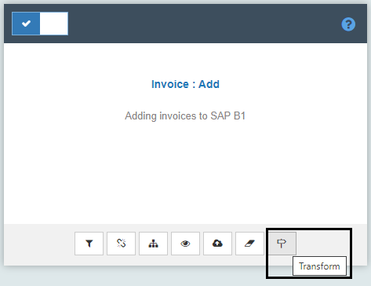

Transformation is a technique or a feature in APPSeCONNECT that lets you convert the data from one format to another. In APPSeCONNECT, the primary job is to ensure the data 
coming from one application could be properly transformed and pushed to target application using the platform. We define Schemas and Actions to map an API such that the
platform can communcate easily. The data coming from an API is mapped directly to the schema such that it could give you a visual inteface where one can map data of one API 
to another. The process of mapping is to ensure the platform could generate an output that could be readily consumable to the destination application. 

The article will help you to understand and work with the `Mapper` functionality in APPSeCONNECT such that you could get expertise around the transformation techniqeues 
and can work with an existing transformation to easily modify or change the output. A mapper node is placed in between two application nodes and it helps in producing an `XML`
document out of an existing document. During the execution, the pipeline sends data to the mapper which converts the data from one schema to another based on the rules defined 
by the implementers in the platform. The mapper node is fully flexible to transform data, and it gives functionalities which could help in developing the document. 

## What is Mapping

The mapping is a technique of converting an XML Document from one format to another. The mapping gives the features that enables the users to easily generate the data for the 
destination API such that it could be easily consumable to the target application. In APPSeCONNECT, `ProcessFlow` provides a Mapper node which can easily dragged on the canvas 
to do the mapping. The mapper node is activated only when both the source and the destination links are drawn, and the mapper uses the schemas defined by the two ends of the application
to give you a document structure. 

In APPSeCONNECT, the structure of document is prepared using the Destination Schema and the implementers need to use `APPSeCONNECT Expression Language` to fill each and every field 
of the target schema, such that the document is prepared by evaluating each expressions. 

[Click](/transformation/basic-of-source-destination-mapping/) to know more about the source and destination mapping.

## Pathway to Transformation

1. Login to the APPSeCONNECT Portal with valid credentials.
2. Navigate to the 'Connections' Page in the APPSeCONNECT Portal.

3. Click 'View the connection' button in the Connection which you have created.

4. Navigate to any of the touchpoints where you want to implement the mapping.
5. Click on the `Transform` button. The Transformation Window opens.  
 
6. The Mapping of the Attributes are done at the **transform** level of the touchpoint.

**Note: This is the Mapping Screen of touchpoint `Invoice Add`. 
The user can expand the Transformation node, to view the attributes present in the touchpoint.**

**Protip:** The user can see the existing mapping for this touchpoint as it is Pre-Packaged. If the user clicks on any other touchpoint,
for any other connection, the pathway and the structure of the Transformations mapping remains the same. 
{: .notice--info}

## Structure of Mapping

[Click](/transformation/getting-started-with-mapping/#structure-of-mapping) to know about structure of Mapping 

## Process of Transformation

The data coming from the source schema requires to be transformed individually such that it matches the format of the destination schema,
everytime the touchpoint is synced.

E.g: Suppose you are executing `Invoice Add` touchpoint, you can see that records of all the `Invoices` are 
drew from the source app and for this case the similar execution process of transformation is deployed multiple
 times. Here a loop is set relatively than writing the transformation logic multiple times, and this undergoes 
execution whenever the touchpoint is synced in the For-Each Loop Node.  

Expanding the `For-each loop` the user gets the view of the node `oInvoices`. `oInvoices` is an object that is used to send data to the target application. 

Note: For different touchpoints the object is different. For the touchpoint `Sales Order Add` the object is `oOrders` for `Simple Product Add` it is `oItems` and so on.

On expanding the object `oInvoices` the user gets the view of the several attributes that are listed under it. 
Each attribute has separate information about the entity that it belongs to.  
Each of these attributes will contain different information about the customer record. 

For Example: `Document_Lines` will contain the details of the Product in terms of Quantity and Unit Price etc, 
`DocumentsAdditionalExpenses` contains the Freight, Tax information etc of the product. 

**Note: Different objects in different touchpoints will have different attributes**  

Expanding the row, displays the destination attributes in the touchpoint level.

All fields or attributes present in the touchpoint are mapped with the corresponding fields of the source schema.

## Root entity variable

A root entity variable is a variable that is value specific to every iteration. 
Every entity item has this variable declared with it such that it is present in every iteration and has a different 
value for every schema item.

Root Entity Variable can be used several times in different parts of the transformation process underlying in the touchpoint. 
Its value however will be different for every iteration.

**Protip** Every Object has - Query params and Root Entity variable, whatever touchpoint they cater to
{: .notice--info}

